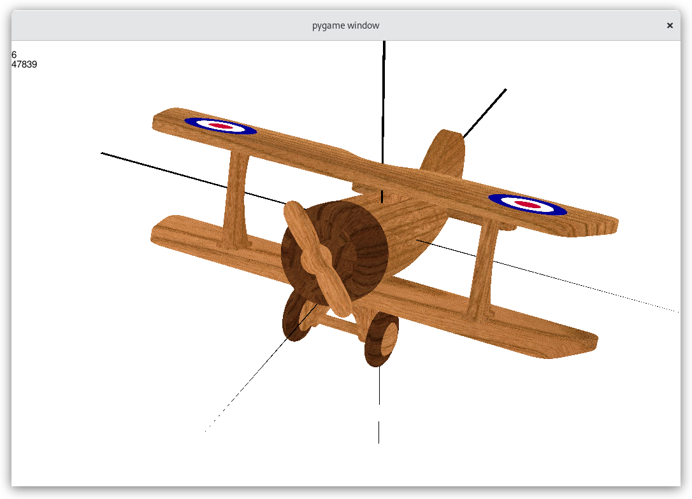

An OpenCL rewrite of Plane3D. Features GPU acceleration, a real time interface, and texturing.
Uses tiled rendering for better performance. Doesn't require image functionality for compatibilty with a wider range of hardware.

plane model: https://free3d.com/3d-model/airplane-v1--592360.html
